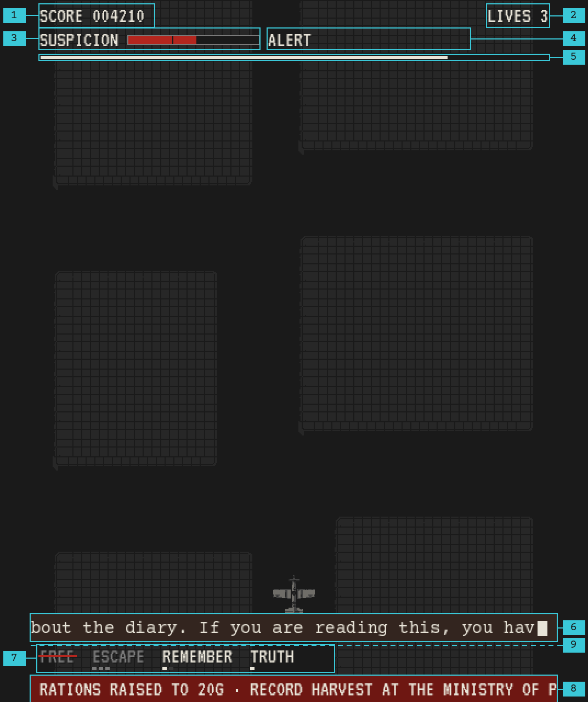
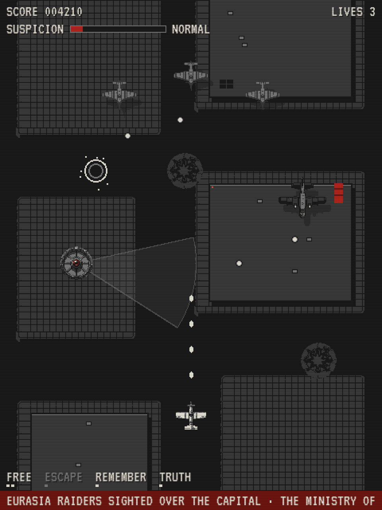
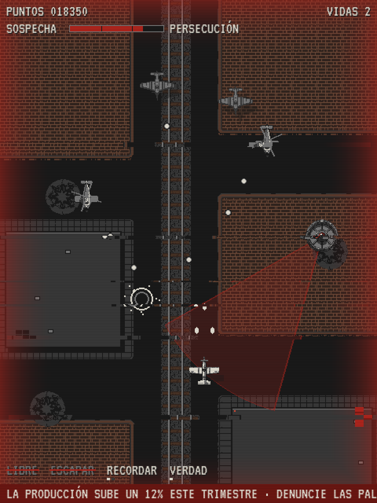
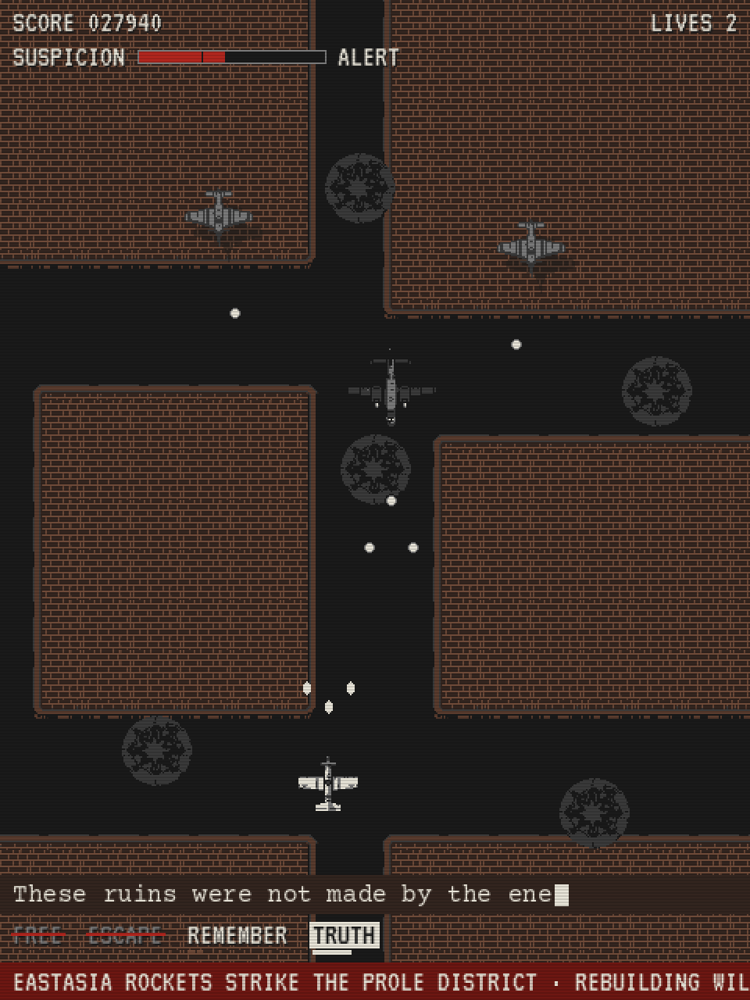
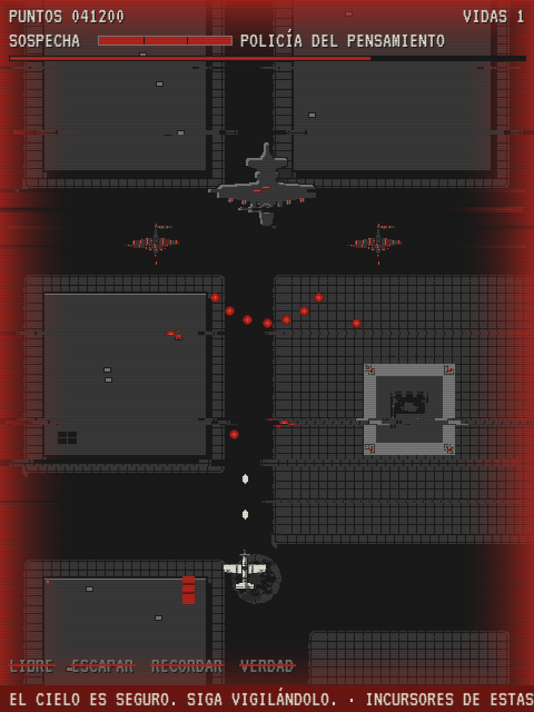

# Art Direction

How *Newspeak 1984* looks and sounds, and why. Every file that implements it: [assets.md](assets.md). How text looks: [text-and-language.md › Typography](text-and-language.md#typography).

## Style

Pixel art seen from directly above, in the spirit of *1942*. Recognizable shapes (aircraft, towers, landmarks, portraits) are sprites; anything geometric, animated, or made of text is drawn by code.

## Palette

Three groups; their constants live in `config.ts`.

| Group | Colors | Used for |
| ----- | ------ | -------- |
| **Core** | `#1a1a1a` ink · `#3a3a3a` concrete · `#7a7a7a` steel · `#e8e4d8` paper | Everything: sprites, UI, text, illustrations. |
| **Regime red** | `#6e1712` dark · `#b3261e` base · `#e0503a` light | Only things that belong to the Party. Base for surfaces and marks, dark for shading and large fills, light only for highlights, small lights, and glows. Every red asset is shaded with the ramp. |
| **Material** | water `#1f2b33` / `#2b3b45` · brick `#33251f` / `#5a3c2e` / `#6e4a38` · wood `#4a3426` | Real materials, dark and muted on purpose: the ground layer (asphalt, plazas, water, rubble, tracks), things fixed to the ground (the AA gun's sandbags), and the diary, whose leather makes it the one human object among the propaganda. |

Each asset uses the groups that help it read. The exception is aircraft: they stay in core colors (plus red if they belong to the regime), so nothing on the ground ever competes with what the player must track.

## Value hierarchy

Dark ground, mid-grey enemies, the player brightest. Readability comes from brightness, not hue. Landmarks other than the white Ministry of Truth are one step darker for the same reason.

## Red belongs to the regime

Red is everywhere the regime is, and nowhere else: nothing the player owns is red, and the rebel ending has none. Most red is drawn by code, so it can react to play:

| Where | Red element | Step |
| ----- | ----------- | ---- |
| City | Hanging Party banners on procedural rooftops (base red, dark-red folds); blinking light-red warning lamps on antennas and ministries. | 1 |
| City | Rooftop murals in red frames; the blimp's banners trimmed in red. | 5 |
| Surveillance | Eye lenses; cones turn red while detecting; destroyed eyes burst in red sparks. | 2 |
| Suspicion | The meter fills in red; a red vignette at the screen edges pulses when seen and grows with suspicion; in pursuit it beats like a pulse. | 2, 5 |
| Airfield | The launch platform's eye; its runway lamps chase in red during takeoff and landing. | 4 |
| Regime forces | Thought Police and the Eye fire red bullets. Foreign enemies' bullets stay light, so a red bullet always means the Party is shooting at you. | 2, 4 |
| Paperwork | Strike-throughs; `CORRECTED` / `APPROVED` stamps in the Ministry; the `VAPORIZED` stamp. | 1, 3, 4 |
| Telescreens | Ticker on a dark-red strip; telescreen frames lit red. | 5 |

## Messages seen from the sky

Wall posters would be invisible from above, so the regime writes for the sky ([mockup](art/poster-mockup.png)):

1. **Rooftop murals:** the Leader's portrait in a red frame with a slogan band.
2. **Ground slogans:** huge letters painted on plazas, like road markings.
3. **Towed banners:** pulled across the screen by a propaganda blimp. They move, so they carry the slogans that flip and contradict each other.

What they say: [text-and-language.md › Channels](text-and-language.md#channels).

## The HUD

The HUD is the Party's instrument panel: from level 1 some of it lies, so it looks like an official display. It is all machine voice, paper on ink, and red only where the regime marks something. The mockups below use the game's real sprites, tilesets, fonts, and palette at 480 × 640, shown at 2×.

| # | Element | Position (logical px) | Content and behavior |
| - | ------- | --------------------- | -------------------- |
| 1 | Score | x 8, baseline 20 | `hud.score` and 6 zero-padded digits. |
| 2 | Lives | right edge at x 472, baseline 20 | `hud.lives` and the number. |
| 3 | Suspicion meter | label at x 8, baseline 42; bar at x 88–208, y 32–40 | Steel outline, ink inside, red fill; ink ticks at 34 and 67 mark the alert thresholds. |
| 4 | Alert state | x 216, baseline 42 | `hud.states`. Reserve 184 px: `POLICÍA DEL PENSAMIENTO` is the longest. |
| 5 | Boss hp bar | x 8–472, y 50–54 | Only while a boss or the Thought Police are on screen. Paper for foreign bosses, red for the regime's own (the Thought Police and the Eye). |
| 6 | Diary line | band at y 560–584, full width | Courier Prime 16 on leather, typed with a block cursor. Once the cursor reaches the right margin the line slides left, like a typewriter carriage, so a line can be longer than the band. Stays a few seconds after it is typed, then goes. |
| 7 | Words | baseline 604, from x 8, two spaces apart; pips at y 608–610 | The four words and their state (below). |
| 8 | Ticker | strip at y 616–640 | VT323 on dark red, scrolling left (step 5). |
| 9 | Playfield bottom | y 588 | The player's sprite stays above it, so the ship never hides under the words. |

There is no backing band: every HUD text has a 1 px ink shadow at (+1, +1), so it reads over plazas and sprites while the top of the screen stays open for incoming enemies. A lying value keeps its position; its tell is the flicker or the 1 px jitter, which a still can't show.

**The words row** is the player's arsenal written as a dictionary entry, so losing a word is seen where the power was. Every state is shown on the word itself:

| State | Look |
| ----- | ---- |
| Available | Paper. Pips under it show the upgrade level, 1 to 3. |
| Recharging (ESCAPE, TRUTH) | Steel word and pips until it is ready again. |
| REMEMBER | Its pips are the bombs: paper for the ones left, concrete for the ones spent this level. |
| Active (TRUTH) | Inverted, ink on a paper box; a paper bar under it drains with the time left. |
| Restored by a diary | Pips in leather (`#6e4a38`): the word was given back by the one human voice. |
| Removed | Steel with a 2 px red strike-through. |

<table>
  <tr>
    <td width="50%"> Level 1: every word available, ESCAPE recharging, a tower's cone idle.</td>
    <td width="50%"> Level 3, in Spanish: a tower sees the pilot in pursuit, with the red vignette and the glitch; FREE and ESCAPE are struck out.</td>
  </tr>
  <tr>
    <td> Level 4: TRUTH active, so the values are real; REMEMBER restored by the diary whose line is being typed.</td>
    <td> Level 5, in Spanish: the Thought Police at 100 suspicion, their red hp bar, every word struck out.</td>
  </tr>
</table>

## The Menu

`menu-city.png` fills the top half of the screen at 2× (480 × 320), and the title (VT323 60, paper) sits on its dark lower third, under the city lights. The options go below the illustration, on ink: the dark band is about 100 px tall, too little for the title, the options, and the honor roll that step 4 adds. The selected option is the only red text. `menu.controls` runs along the bottom in steel; in Spanish it is exactly 60 characters, all a VT323 20 line holds, so a longer version must drop a word.

## The page around the game

The game is a telescreen set into a concrete wall. The canvas sits in a concrete bezel with a red power lamp that never goes off. On wide windows the Leader's portrait (`poster-leader.png` at 3× or 4×, mirrored on the right) hangs on each side facing the screen; on narrow ones the portraits disappear before they crowd the game. Wall and portraits are dimmed so the game stays the brightest thing on the page. The page has no text: everything the player reads comes from `src/i18n/`, inside the game.

## The screen under strain

Permanent scanlines, plus a glitch that grows with suspicion. Together with the red vignette, the player feels watched without reading the meter.

## Sound

Not designed yet. Files go in `public/assets/sounds/`, played with the Web Audio API.
