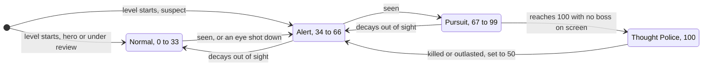
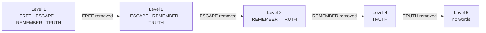
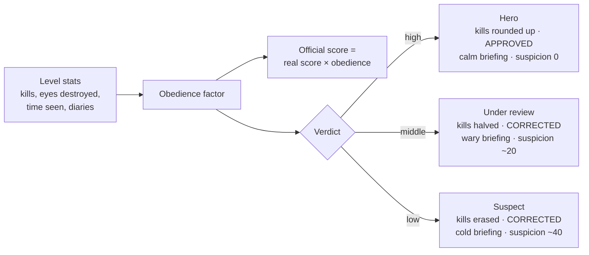
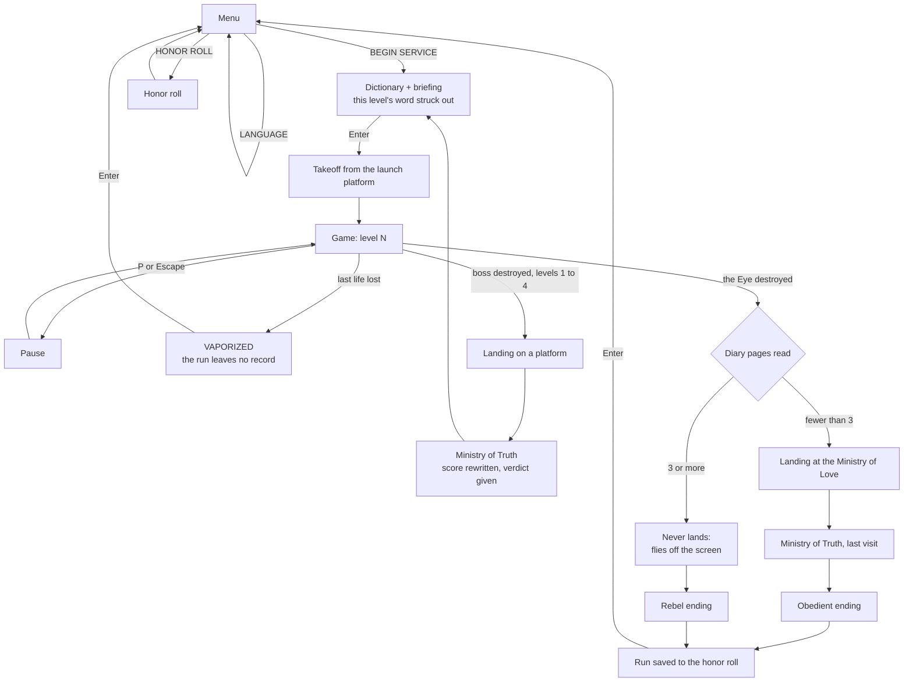

# Gameplay

How *Newspeak 1984* plays: the rules, the controls, the levels, and the enemies. Why each rule exists, in story terms: [narrative.md](narrative.md). Exact numbers and acceptance criteria: [implementation-plan.md](implementation-plan.md).

## Combat

| Mechanic | Rule |
| -------- | ---- |
| Lives | A few real lives; getting hit costs one and respawns the pilot with blinking invulnerability. Losing the last one is game over (VAPORIZED). |
| Shooting | Hold to fire straight up; FREE turns it into a spread. |
| Dash | ESCAPE: a short dash with 0.5 s of invulnerability, on a cooldown. |
| Bomb | REMEMBER: clears normal enemies and bullets, damages bosses; one per level for each upgrade level. |
| Truth | TRUTH: a timed ability that shows real values and camouflaged enemies. |
| Bosses | One per level, with attack phases; they visibly break as they lose hp (see [Feedback and damage](#feedback-and-damage)). |
| Score | Kills add to the real score, which is tracked silently. The HUD shows what Propaganda allows. |

## Surveillance and suspicion

Towers and drones sweep vision cones. Being seen raises **suspicion** (faster up close); it decays out of sight. It is the main tension dial:

| Suspicion | State | Effect |
| --------- | ----- | ------ |
| 0–33 | Normal | A standard shmup. |
| 34–66 | Alert | More enemies and bullets. |
| 67–99 | Pursuit | Autogyros hunt the player. |
| 100 | Thought Police | A mini-boss; kill it or outlast it, and suspicion drops to 50. Never during a boss fight. |

Destroying an eye is allowed but costs +15: you can fight the system, but it notices. Suspicion is also felt without reading the meter: the screen glitches harder and a red vignette closes in.

## Newspeak: words as power-ups

Abilities are words: `FREE` (spread shot), `ESCAPE` (dash), `TRUTH` (see through lies), `REMEMBER` (bomb). From level 2 the Party removes one per level: FREE → ESCAPE → REMEMBER → TRUTH. A removed word's pickup appears crossed out, gives nothing, and raises suspicion (+10), so players learn to stop reaching for what was taken.

Upgrades last the whole run, so every removal takes away something the player built. A **diary** page restores the most recently removed word, at the level it had, for the rest of that level (+25 suspicion).

## Doublethink: the lying HUD

The HUD shows what the Party wants believed. Each level adds a lie: (1) the ticker's alliance flips and rewrites the past, (2) the score is inflated, (3) a fake extra life appears now and then, (4) some enemies look like allies but still shoot. Every false value has a tell (a flicker or 1 px jitter), and `TRUTH` reveals the real values. In level 5 `TRUTH` is gone: every lie at once, and only attention sees through them.

## Ministry of Truth: the rewritten score

After each level the real score is crossed out and an "official" one typed in, scaled by obedience: kills raise it; destroyed eyes, time observed, and diaries lower it. A list of bureaucratic "corrections" justifies the changes. The Ministry then gives its verdict on the pilot: a hero's kills are rounded up, a pilot under review shares them with the squadron, and a suspect's are erased. The verdict, not what really happened, also sets the next briefing's tone and the suspicion the next level starts with: a hero's file is closed, a suspect's stays open. At every visit, past high scores are quietly altered or replaced with `[UNPERSON]`. Only completed runs are recorded; a vaporized pilot leaves no entry. The real score appears only in the rebel ending.

## Feedback and damage

| Event | What the player sees |
| ----- | -------------------- |
| Enemy hit | The sprite flashes white for ~3 frames (`-flash` variant). |
| Enemy destroyed | An explosion of expanding circles and particles; eyes burst in red sparks. |
| Boss losing hp | **Progressive damage:** holes, burns, and cracks appear one by one from its damage map, with smoke from the holes. At 20% hp it is fully wrecked. The player reads progress without looking at the hp bar. |
| Player hit | Lives drop; the pilot respawns blinking. |
| Being seen | The cone turns red and the red vignette pulses. |
| A lie on the HUD | Its tell: a one-frame flicker or a 1 px jitter. |

## Controls

| Action | Keys |
| ------ | ---- |
| Move | Arrows or WASD |
| Shoot (hold) | `Space` or `Z` |
| Dash (ESCAPE) | `X` or `Shift` |
| Bomb (REMEMBER) | `C` |
| Truth (TRUTH) | `V` |
| Menu: select / activate | Up and Down / `Enter` or Shoot |
| Confirm / skip text | `Enter` |
| Pause | `P` or `Escape` |

## Structure

**Flow:** Menu → Dictionary → Game → Ministry → Dictionary → … → Ending. Losing every life shows VAPORIZED; `Enter` returns to the Menu. Between levels, the Ministry rewrites suspicion from its verdict. The scenes in this flow are described in [narrative.md › Scenes](narrative.md#scenes).

- **In a level:** take off from the Party's launch platform, fly, shoot, dodge, stay out of the eyes' sight, collect words, maybe risk a diary, beat the boss, and land on another platform. The plane flies itself during takeoff and landing.
- **Between levels:** the Ministry rewrites the score; the Dictionary and the Officer announce the next word to be removed.

| Level | Word removed | New lie | Boss | Terrain and landmark |
| ----- | ------------ | ------- | ---- | -------------------- |
| 1 | — | Ticker alliance flips | Flying fortress | City plazas; the Ministry of Truth |
| 2 | FREE | Inflated score | War zeppelin | The river and its bridges (bottlenecks); the Ministry of Plenty |
| 3 | ESCAPE | Fake extra life | Land battleship, a ground boss on the railway | Rubble and railway; the Ministry of Peace |
| 4 | REMEMBER | "Allied" enemies | Flying wing | The ruined prole district: no ministry, only rubble |
| 5 | TRUTH | All of them, with no TRUTH | **The Eye**, the Party's own fortress | The Ministry of Love |

## Cast

| Enemy | Role | Behavior |
| ----- | ---- | -------- |
| Fighter | Basic | Straight or weaving, aimed shots. Can be camouflaged (visible with TRUTH) or disguised as an ally. |
| Bomber | Heavy | Slower, tougher, more bullets. |
| Autogyro | Pursuit | Spawns at high suspicion, homes in. |
| AA gun | Ground turret | Aims its twin barrels at the player. |
| Eye tower, drone | Surveillance | Don't shoot; being seen raises suspicion. |
| Thought Police + escort | Mini-boss | Arrives at suspicion 100. Red bullets. |
| Bosses | One per level | See the level table; the Eye fires red bullets. |
| Propaganda blimp | Not an enemy | Crosses the screen towing slogan banners; can't be shot, doesn't collide. |

Foreign enemies fire light bullets; only the regime's own forces fire red.

## Decisions

See [implementation-plan.md › Decisions](implementation-plan.md#decisions).
