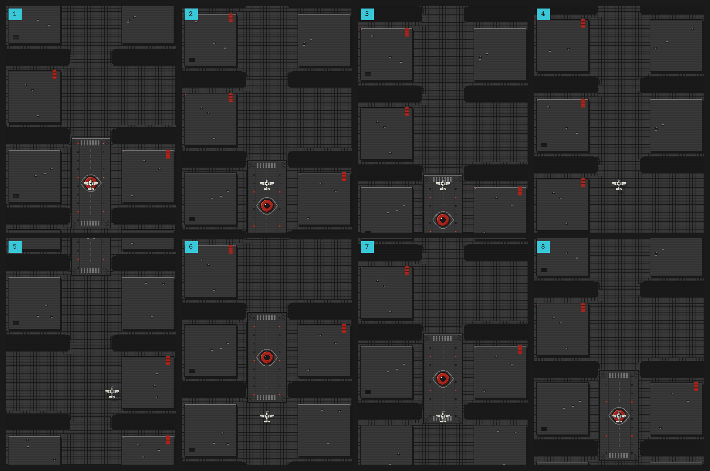
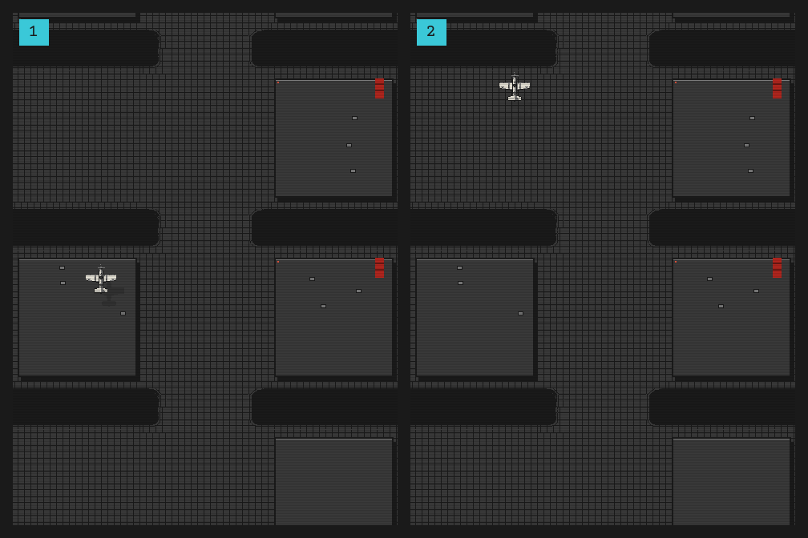

# Implementation Plan

This document says **what** to build in each step, **how the pieces fit together**, and **how to tell when a step is finished**. The design comes from the other documents in `docs/` (overview: [README.md](README.md)). Where they leave a gap, this plan fills it with a proposal, marked **Decision**. Every decision is collected in [Decisions](#decisions); an open one can still change before you build the step that depends on it.

Every step ends with a playable game. Each one finishes with a version bump (see [technical.md › Git](technical.md#git)).

| Step | Delivers | Version | Status |
| ---- | -------- | ------- | ------ |
| 0 | Scaffold: Vite, TypeScript, p5, tooling; an "under construction" page to test the deploy | `0.1.0`, `0.1.1` | Done |
| 1 | Core shmup: scenes, input, player, enemies, collisions, scrolling, HUD | `0.2.0` | Done |
| 2 | Surveillance Eyes and Suspicion | `0.3.0` | Done |
| 3 | Newspeak: words, pickups, diaries, Dictionary scene | `0.4.0` | Not started |
| 4 | Level flow, bosses, Ministry of Truth, high scores, endings | `0.5.0` | Not started |
| 5 | Propaganda (lying HUD), ticker, glitch, scanlines, messages from the sky, pause | `0.6.0` | Not started |
| — | Content and balance for all 5 levels, polish | `1.0.0` | Not started |

---

## Before you start

The conventions every step relies on are documented outside this plan:

- **Runtime conventions** (frame-based time, 480×640 canvas, scroll-distance coordinates, `Vec`, input), **architecture**, and **rendering and performance rules**: [technical.md](technical.md).
- **The idea, story, and scenes**: [README.md](README.md) (overview) and [narrative.md](narrative.md).
- **Controls**, mechanics, levels, and enemies: [gameplay.md](gameplay.md).
- **Every text, when it appears, fonts, and languages**: [text-and-language.md](text-and-language.md).
- **Palette and the regime's red**: [art-direction.md](art-direction.md).
- **Which sprite, illustration, or font each element uses**: [assets.md](assets.md).

---

## Step 1: Core shmup (`0.2.0`)

**Goal:** a plain vertical shooter that already uses the final architecture. There is no theme yet beyond the palette.

**Progress:** the page shell, canvas, asset loader, input, `SceneManager` tick, language detection, `state.ts`, and the Menu are done. `BEGIN SERVICE` starts a playable `GameScene` over level 1's scrolling city: level 1's waves fly in and shoot, enemies flash, explode, and score, and the player loses lives and respawns blinking. The HUD shows the score and lives through `Propaganda`, and losing the last life lets the crash play out, then shows VAPORIZED. The city is drawn from `layout.ts`: ground tiles, craters, and procedural rooftops with skylights, fixtures, Party banners, and blinking lamps. Every file from the structure exists; the ones later steps fill in are typed stubs. **Step 1 is done** and released as `0.2.0`. Next: step 2.

### Files

Create every file from the structure in [technical.md › Project structure](technical.md#project-structure). Files that are not part of this step are **typed stubs**: they export the class, function, or type with the right name, and the body is empty or returns a neutral value. Later steps fill them in without changing any imports.

| File | Status | In this step |
| ---- | ------ | ------------ |
| `index.html`, `style.css` | Done | The telescreen wall ([art-direction.md › The page around the game](art-direction.md#the-page-around-the-game)) with a centered `#game` frame; pass it to `new p5(sketch, element)` so the canvas mounts there. The styles keep an upscaled canvas crisp (`image-rendering: pixelated`). |
| `core/display.ts` | Done | `fitCanvas()` scales the canvas by the largest integer factor that fits the window minus the frame, computed in device pixels so it stays crisp at 125% or 150% OS zoom. It measures the frame as `#game`'s size minus the canvas's, so the frame's thickness lives only in the CSS. The game itself always works in 480 × 640. |
| `main.ts` | Done | Creates the p5 instance in `#game`; `setup` creates the canvas, sets `pixelDensity(1)` (the CSS does all the upscaling) and `noSmooth()`, fits it on start and on `resize`, then awaits the assets and hands them to the `SceneManager`, starting on `MenuScene`; `draw` calls `manager.frame(p.deltaTime)`. |
| `config.ts` | Done | The canvas size, the core palette and regime red ramp, key bindings, tick, starting lives, and the player, bullet, shadow, enemy, explosion, scroll, respawn, game over, city layout, and rooftop numbers. The material tones ([art-direction.md](art-direction.md)) are added with their first use in code; the AA gun's sandbags are painted in its sprite, so the first is the diary's band in step 3 |
| `assets.ts`, `assets.test.ts` | Done | Every asset file listed by folder and loaded in parallel; the tests keep the lists in step with the disk and check the JSON data. Next: give the loaded assets to the `SceneManager`. |
| `types.ts` | Done | `Vec`, `TilesetDef`, `DamageMap`, `PlatformDef`, `Word`, `EnemyKind`, `WaveDef`, `TerrainDef` (seed and block shares; later steps add the river, railway, and landmark), `LevelDef`, `ALERT` with `AlertLevel`, and `GameState` (shapes below) |
| `i18n/en.ts`, `i18n/es.ts` | Done | Every player-facing text in English and Spanish. `es` is typed against `en`, so a missing translation fails the typecheck. |
| `i18n/index.ts`, `index.test.ts` | Done | Language detection and `t()` (see **Language** below); `main.ts` calls `initLanguage()` once. `t()` only accepts paths to a single string, so a misspelled key fails the typecheck |
| `state.ts`, `state.test.ts` | Done | `state` object with the step 1 fields from [technical.md › Global state](technical.md#global-state), `resetGame()`, `resetLevelState()`. Both reset `state` in place, so every module that imported it sees the new run |
| `core/Scene.ts` | Done | `Scene` interface |
| `core/SceneManager.ts`, `SceneManager.test.ts` | Done | Holds the current scene, switches between scenes, and runs the fixed tick; the tests cover the tick loop |
| `core/Input.ts`, `Input.test.ts` | Done | Keyboard state by action; the tests drive it with a plain `EventTarget`, since Node has no `KeyboardEvent` |
| `core/Collisions.ts`, `Collisions.test.ts` | Done | Circle–circle test |
| `entities/Entity.ts`, `Entity.test.ts` | Done | Abstract base class; `drawAircraft()` draws any aircraft over its shadow |
| `entities/Player.ts`, `Bullet.ts`, `Enemy.ts`, `Explosion.ts` | Done | Real implementations, with tests; the player and enemies hand their bullets to the scene through a callback, and `Enemy.hit()` reports the killing hit once |
| `entities/Eye.ts`, `Boss.ts`, `Pickup.ts` | Done | Stubs; step 2 fills in `Eye` and `Boss` |
| `systems/Spawner.ts`, `Spawner.test.ts` | Done | Reads waves from level data; spawns each wave once, just above the top edge, and restarts its waves from the current scroll for the loop |
| `systems/Propaganda.ts`, `Propaganda.test.ts` | Done | **Pass-through version**: returns the real values and never lies |
| `systems/Suspicion.ts`, `Newspeak.ts`, `Ministry.ts` | Done | Stubs; step 2 fills in `Suspicion` |
| `levels/levels.ts`, `levels.test.ts` | Done | Level 1: its terrain recipe and waves; the tests keep the waves sorted and on screen |
| `levels/layout.ts`, `layout.test.ts` | Done | City generator: streets, blocks, buildings, craters (see **Background** below); the tests run 30 mixed recipes over 8 chunks each |
| `levels/Background.ts`, `Background.test.ts` | Done | Scrolling background, one `p5.Graphics` per chunk: ground tiles, craters, and procedural rooftops with skylights, fixtures, and banners; lamps blink on top every frame. The tests cover which chunks are on screen and that every cell finds its tile |
| `ui/HUD.ts`, `HUD.test.ts` | Done | Lives and score, read **through `Propaganda`**; labels from `t()`. A test reads the file's source and fails if it mentions `state` |
| `ui/Ticker.ts`, `ui/effects.ts` | Done | Stubs; step 2 adds the red vignette to `effects` |
| `scenes/MenuScene.ts`, `MenuScene.test.ts` | Done | `menu-city.png` with the title and the option list (see **Menu** below); the tests cover the navigation |
| `scenes/GameScene.ts`, `GameScene.test.ts` | Done | Runs the player, the spawner, enemies, bullets, explosions, collisions, and the scroll over the background, and loops the waves once cleared; the tests cover the collision rules, the game over delay, and the loop. Draws the HUD last. |
| `scenes/GameOverScene.ts`, `GameOverScene.test.ts` | Done | The VAPORIZED screen (see **Game over** below) |
| `scenes/DictionaryScene.ts`, `MinistryScene.ts`, `EndingScene.ts` | Done | Stubs |

### Specification

**Scene and SceneManager**

- `Scene` has four methods: `enter(): void`, `update(): void`, `draw(): void`, and `exit(): void`.
- `SceneManager.change(next: Scene)` calls `exit()` on the current scene, swaps it out, and calls `enter()` on the new one. Scenes receive `p` and the manager in their constructor so they can switch scenes themselves.
- **Decision:** a fixed 60 Hz tick. `SceneManager.frame(ms)` adds the elapsed time to an accumulator and, for every 1/60 s in it, calls the scene's `update()` and then `input.endFrame()`, at most `MAX_UPDATES_PER_FRAME` (2) times; if whole ticks are still owed after the cap, it drops them, but a partial tick always carries over, or a 35 Hz screen would lose a fraction of a tick every draw and run the game at about 52 Hz; then it calls the scene's `draw()` once. Game logic still counts frames, but the speed no longer depends on the monitor: p5 only draws on the screen's refreshes, so on a 75, 90, or 100 Hz screen it manages 45–50 draws per second, and one update per draw would run the game 15–25% slow. A slow machine still slows the game down instead of skipping ahead.

**Input**

- Listens to `keydown` and `keyup` on `window` and keeps a `Set<string>` of the codes that are held down. Call `preventDefault()` for the game keys so the arrow keys and Space don't scroll the page.
- `isDown(action)` reports whether any key bound to the action is held, for example `isDown('shoot')`. `wasPressed(action)` is true only on the tick the key went down; auto-repeat doesn't count as a new press. `endFrame()` clears the "pressed this tick" set.
- The bindings follow [gameplay.md › Controls](gameplay.md#controls); the key mapping lives in `config.ts` (`KEYS`).
- On `blur`, release every held key: a key released while the page has no focus never sends its `keyup`.

**Entity**

- Abstract class with `pos: Vec`, `vel: Vec`, `radius: number`, `alive: boolean`, `update(): void`, and `draw(p: p5): void`.
- The default `update()` adds `vel` to `pos`. Add `isOffscreen(margin)` so dead entities can be culled.

**Player**

- Moves at a constant speed with 8 directions; diagonal movement is normalized. The player is clamped inside the canvas and above `PLAYFIELD_BOTTOM` (588), so the ship never hides under the HUD's words row.
- Holding Shoot fires straight up every `PLAYER_FIRE_COOLDOWN` frames.
- When hit, the player loses one real life and respawns at the bottom center with `RESPAWN_INVULN_FRAMES` frames of invulnerability. While invulnerable, the ship blinks by skipping its draw every few frames.
- When the last life is lost, the game is over (see **Game over** below).

**Pilot ID**

- **Decision:** `resetGame()` draws `state.pilotId`, a random number from 1 to 9999 stored zero-padded (`0042`), once per run. Every `{id}` placeholder uses it, so each run is a different pilot and the honor roll doesn't repeat one name.

**Bullet**

- Has an owner, `'player'` or `'enemy'`, a speed, and a radius. It dies when it leaves the screen.

**Enemy**

- Spawned by the Spawner from a wave. Each enemy has `hp`, a `score` value, and a `kind`.
- Step 1 kinds:
  - `straight` (`enemy-fighter.png`) flies straight down; `sine` (the same sprite) flies down while weaving horizontally. Both shoot at the player's current position every `ENEMY_FIRE_INTERVAL` frames, give or take `ENEMY_FIRE_JITTER`, so a wave doesn't fire in unison. The fire clock only runs on screen.
  - `bomber` (`enemy-bomber.png`) flies straight down, slower and with more hp. Every `BOMBER_FIRE_INTERVAL` frames it fires a fan of `BOMBER_FAN_COUNT` bullets centered on the player.
- A hit that doesn't kill it swaps the sprite for its `-flash` variant for `HIT_FLASH_FRAMES` (~3) frames.
- It dies at 0 hp, which spawns an `Explosion`, adds `score` to `state.realScore`, and increments `stats.kills`. It is removed when it leaves the screen.

**Explosion**

- An `Entity` with no hitbox: a few circles that expand and fade over `EXPLOSION_FRAMES` (~20) frames, plus particles flying outward. The color is a parameter, so step 2 reuses it for the eyes' red sparks.
- Spawned where an enemy or the player dies. It stays where it was spawned (aircraft fly above the ground) and dies when it fades out.

**Collisions**

- `circlesOverlap(a, b)` returns `dx*dx + dy*dy < (ra + rb)^2`. Compare squared distances so no square root is needed.
- `GameScene` checks three pairs: player bullets against enemies, enemy bullets against the player, and enemies against the player. A crash destroys the enemy too but scores nothing, since it isn't a kill. While invulnerable, the player ignores all three, and the respawn happens on the hit itself, so two hits on one tick cost one life.

**Spawner**

- Holds the `LevelDef` and the current scroll distance. When `scroll >= wave.at`, it spawns that wave once.
- A wave is data, for example `{ at: 600, kind: 'sine', count: 5, x: 240, spacing: 40 }`.

**Background**

- Build the background from chunks, as described in [technical.md › Background](technical.md#background). In this step, the ground tilesets, craters, and procedural rooftops are enough; landmarks and posters come in step 5.
- **Decision:** terrain is generated by rules from a recipe in the level data, as described in [technical.md › City layout](technical.md#city-layout). In this step, `layout.ts` needs rules 1–3: streets, plaza and asphalt blocks, buildings, and craters. Anchors come in step 2; the river, railway, and landmark come with the content that uses them.
- Draw the current chunk and the next one, offset by the scroll, so there is never a seam. Build the chunk above while it is still off screen, and free the ones below.
- The scroll speed is `SCROLL_SPEED` px per frame. The Spawner and, later, the eyes use the same scroll value.

**Language** (`i18n/index.ts`)

- Detection, `t()`, and the rules for strings: [text-and-language.md › Translation files](text-and-language.md#translation-files).
- Changing language redraws the current scene; nothing else depends on it.

**Menu**

- **Decision:** under the title, a vertical list: `BEGIN SERVICE` and `LANGUAGE: ENGLISH` (step 4 adds `HONOR ROLL`). Up and Down move the selection; Enter or Shoot activates it.
- `BEGIN SERVICE` calls `resetGame()` and starts the run. On `LANGUAGE`, Enter, Shoot, or Right moves to the next language and Left to the previous one, and the choice is saved (`try/catch`).
- Shoot confirms only in the Menu. Everywhere else it is Enter, so a held fire button never skips the text at the end of a level.

**Game over**

- **Decision:** a scene of its own, `GameOverScene`, since VAPORIZED is not an ending. When the last life is lost, the game keeps running for `GAME_OVER_DELAY` frames (2 s) without the player: the crash plays out and the world flies on. Then the telescreen cuts the broadcast over `SIGNAL_OFF_FRAMES`: the game's last frame collapses into a brightening line, the line shrinks to a dot, and the dot fades. `vaporized.png` fades in from ink over `PHOTO_FADE_FRAMES`; `STAMP_DELAY` frames after it starts the red `VAPORIZED` stamp lands on the erased pilot, and `GAME_OVER_TEXT_DELAY` frames later `gameOver.line` and `PRESS ENTER` appear. Enter returns to the Menu, but only once it has been offered, so a key mashed during the crash can't skip the screen.
- The run is not recorded: only completed runs reach the honor roll (step 4). The vaporized pilot leaves no trace, like the diarist.

**HUD**

- Layout and look: [art-direction.md › The HUD](art-direction.md#the-hud).
- Shows score (top left) and lives (top right). It calls `propaganda.displayedScore()` and `propaganda.displayedLives()` and never reads `state` directly. In this step those methods return the real values.

**GameScene**

- `enter()` resets the level state and builds the background and spawner.
- `update()` order: input → player → spawner → entities → collisions → cull dead entities → scroll.
- `draw()` order: background → enemies → bullets → player → explosions → HUD.
- For now, once the last wave is cleared the waves start over: the Spawner measures them from the scroll at which the pass began. The scroll itself never goes back, so the city flies on instead of jumping. Proper level ends come in step 4.

### Shapes (`types.ts`)

```ts
type Vec = { x: number; y: number };
type Word = "FREE" | "ESCAPE" | "TRUTH" | "REMEMBER";
// Ordered, so code can ask for "at least pursuit": state.alertLevel >= ALERT.pursuit.
const ALERT = { normal: 0, alert: 1, pursuit: 2, thoughtPolice: 3 } as const;
type AlertLevel = (typeof ALERT)[keyof typeof ALERT];
type EnemyKind = "straight" | "sine" | "bomber"; // step 2 adds "homing"

interface WaveDef {
  at: number;          // scroll distance
  kind: EnemyKind;     // never "homing": see step 2 › Pursuit
  count: number;
  x: number;           // spawn x of the first enemy
  spacing: number;     // horizontal gap between enemies
}

interface LevelDef {
  terrain: TerrainDef; // shape in technical.md › City layout
  waves: WaveDef[];
  // added in later steps: eyes, turrets, pickups, diary, boss, length
}
```

### p5 additions on assets

Details in [assets.md › Assets that need p5 additions](assets.md#assets-that-need-p5-additions).

- **Every aircraft:** draw its `-shadow` variant first, offset, at about 40% alpha.
- **Enemies:** the `-flash` variant on hit; explosions on death.
- **Regime red in the city:** hanging Party banners on part of the procedural rooftops (`#b3261e` with `#6e1712` folds) and blinking `#e0503a` warning lamps on antennas.
- **Player:** blink while invulnerable.
- **Menu:** draw `menu-city.png` at 2× with the title on its dark lower third and the option list below it ([art-direction.md › The Menu](art-direction.md#the-menu)).
- **Game over:** draw `vaporized.png` at 2×, then stamp a red "VAPORIZED" over it.

### Done when

- [x] `pnpm typecheck` and `pnpm build` pass.
- [x] The canvas stays centered and crisp at every window size, scaled by a whole number.
- [x] In the Menu, Up and Down select an option, and Enter or Shoot activates it. `BEGIN SERVICE` starts the game.
- [x] The player moves in 8 directions, stays on screen, and shoots by holding the button.
- [x] Level 1 waves appear at their scroll positions and shoot back. Bombers are slower, take several hits, and fire fans.
- [x] Hit enemies flash, and destroyed ones explode and add score. Getting hit costs a life, then the player respawns with blinking invulnerability.
- [x] Losing all lives shows "VAPORIZED" with this run's pilot ID; Enter returns to the Menu. A new run gets a new ID.
- [x] The background scrolls with no visible seam.
- [x] `layout.test.ts` passes: the same seed gives the same chunk, consecutive chunks join on their streets, and no cell mixes asphalt with two other terrains.
- [x] The HUD gets every value through `Propaganda`; a search for `state.` in `ui/HUD.ts` finds nothing.
- [x] Every file from the structure exists, and the stubs typecheck.
- [x] The game starts in English; `?lang=` or a saved choice overrides it; the Menu option switches and remembers it, even with storage blocked (it just won't persist).
- [x] No inline player-facing strings: searching `src/` outside `i18n/` for quoted UPPERCASE text finds none.

---

## Step 2: Surveillance Eyes and Suspicion (`0.3.0`)

**Goal:** the regime watches you. Being seen has consequences that escalate.

**Progress:** the city's layout now generates anchors, and towers and AA turrets stand on them while drones patrol above. Every eye sweeps a cone that turns red the moment it sees the pilot; being seen raises suspicion, faster up close, and it decays out of sight. Shooting an eye down bursts it in red sparks and costs +15. The HUD shows the suspicion meter and the alert state through `Propaganda`, and a red vignette beats while the pilot is seen. At 34 waves grow by a row of reinforcements and every shooter reloads faster; at 67 homing autogyros give chase; at 100 suspicion freezes and the Thought Police come with their escort and red fire, holding the waves back until they are shot down or outlasted, which leaves suspicion at 50. **Step 2 is done** and released as `0.3.0`. Next: step 3.

### Files

`entities/Eye.ts`, `entities/Turret.ts`, `entities/ThoughtPolice.ts`, `systems/Suspicion.ts`, `entities/Boss.ts` (the base of the Thought Police), and updates to `levels/levels.ts`, `levels/layout.ts` (anchors), `systems/Spawner.ts`, `systems/Propaganda.ts`, `entities/Enemy.ts`, `config.ts`, `ui/HUD.ts`, and `scenes/GameScene.ts`.

### Specification

**Eye**

- There are two types:
  - `tower`: fixed to the ground, so it scrolls down with the background.
  - `drone`: flies a patrol path, either back and forth between two x positions or along a sine path, while descending slowly.
- Vision cone: `facing` (the base angle), `aperture` (default 45°), `range`, and a sinusoidal sweep `angle = facing + sweepAmp * sin(frame * sweepSpeed + phase)`.
- Detection: `dist(eye, player) < range` **and** `abs(atan2(sin(d), cos(d))) < aperture / 2`, where `d = angleToPlayer - angle`. Line of sight is ignored; buildings don't block vision.
- Drawing: a `p.arc(x, y, 2*range, 2*range, angle - aperture/2, angle + aperture/2, PIE)` with low-alpha fill. It is grey (`#7a7a7a`) when idle and red (`#b3261e`) when detecting.
- Only a pilot still flying can be seen: the cones go quiet while the plane goes down.
- Eyes have hp and can be shot down. Destroying one bursts in red sparks (a red `Explosion`), adds **+15 suspicion** immediately, and increments `stats.eyesDestroyed`. Eyes don't shoot.
- **Decision:** eyes never collide with the player. Towers stand on the ground and drones fly below the plane; their threat is being seen, not being hit, so aircraft kill and eyes inform on you.
- Eyes are placed by level data: `eyes: [{ at, type, facing, range, sweepAmp, sweepSpeed, aperture? }]`, plus `on` for a tower and `x` and `path` for a drone. A tower stands on an anchor (`on: 'rooftop'`, `'plaza'`, or `'street'`); a drone flies, so it uses `x`, and its `path` is `'patrol'` (back and forth at an even speed) or `'sine'`, `DRONE_PATROL_REACH` either side. Angles are in degrees, clockwise from pointing right, so `facing: 90` looks down the screen; `sweepSpeed` is radians of sweep per frame.
- A drone is drawn in code: a grey hub with a red lens, a rotor spinning at each diagonal, and a round shadow.

**Anchors** (`levels/layout.ts`)

- The layout now returns anchors, and `anchorNear(terrain, kind, at)` finds the nearest one ([technical.md › City layout](technical.md#city-layout)). Every ground element uses it, so none ends up floating over the wrong terrain.

**Suspicion** (owns `state.suspicion` and `state.alertLevel`)

- `update(seenBy: Eye[], player: Vec)`:
  - If at least one eye sees the player, suspicion rises by `lerp(1.2, 0.3, distance / range)` per frame, using the detecting eye with the lowest `distance / range`, the one the player is deepest inside. Closer eyes raise it faster. Increment `stats.framesSeen`.
  - If no eye sees the player, it decays by `0.05` per frame.
  - Clamp the value to `[0, 100]`.
- `add(amount)` is used for instant changes: destroying an eye, and in later steps crossed-out pickups and diaries.
- `resetLevelState()` doesn't touch suspicion. Until step 4 it simply carries over; from step 4 the Ministry rewrites it between levels (see **The Party's verdict**).
- The alert level comes from thresholds in `config.ts`:

  | Suspicion | Level | Effect |
  | --------- | ----- | ------ |
  | 0–33 | 0, normal | none |
  | 34–66 | 1, alert | +30% spawn rate and more enemy fire |
  | 67–99 | 2, pursuit | the effects above, plus homing autogyros |
  | 100 | 3, Thought Police | see below |

- **Alert:** the Spawner adds extra enemies to each wave (`count * ALERT_SPAWN_MULT`, rounded up), and the fire intervals (`ENEMY_FIRE_INTERVAL`, `BOMBER_FIRE_INTERVAL`) are divided by `ALERT_FIRE_MULT`. **Decision:** the extra enemies fly as a row of reinforcements behind the wave, over its first enemies' columns, so a wave never runs off the side or stacks two enemies on one spot; a lone bomber becomes two in line. An enemy reads the alert at every reload, so those already on screen fire faster from their next shot.
- **Pursuit:** the Spawner adds autogyros (`enemy-gyro.png`) with the `homing` behavior: one at once, then one every `GYRO_INTERVAL` frames at a random x above the top edge. The pace is kept across dips out of pursuit, so hovering at 67 can't call them faster. They turn toward the player at a capped turn rate (`HOMING_TURN_RATE`), so they can be dodged, and give up the chase after `HOMING_FRAMES`, flying on until they leave by any edge. Their distinct silhouette tells the player the regime is chasing them, and the sprite turns with their heading.
- **Decision:** autogyros never fire; their weapon is themselves. Shooting one scores, ramming it costs a life like any crash.
- **Decision:** autogyros come only from pursuit up, never in a level's waves, so their silhouette always means the regime is chasing you. `WaveDef.kind` excludes `homing`, so level data can't break the signal.
- **Thought Police:** when suspicion reaches 100, `alertLevel` becomes 3 and the Thought Police spawn: a mini-boss built on `Boss` (hp bar, attack pattern, red accents) with a small escort. **Decision:** suspicion is frozen while they are on screen. If the player kills them, or survives `THOUGHT_POLICE_TIMEOUT` frames until they withdraw off the top of the screen, suspicion resets to **50**. Outlasting them counts as much as beating them, which matters once FREE is gone.
- They never spawn while a level boss is alive: suspicion stays at 100, with the pursuit effects, until the boss dies. They come back in the same level if suspicion climbs to 100 again.
- Suspicion freezes itself the moment it reaches 100, whatever moved it, and only `release()` (to `THOUGHT_POLICE_RESET`) unfreezes it. A jump to 100 from an eye shot down mid-tick can't decay away before the scene sees it, and the level-boss rule in step 4 holds it at 100 the same way.
- **Decision:** the Thought Police (`entities/ThoughtPolice.ts`, on `Boss`) come down to hover near the top, sway side to side, and alternate an aimed triple with a wide fan of 7. They hold fire on the way in and while withdrawing; ramming them costs a life and leaves them flying. Shooting them down scores (`THOUGHT_POLICE_STATS`).
- **Decision:** the escort is two `escort` enemies (`thought-police-escort.png`) flying in formation beside them. They can be shot down for points, and they withdraw with the Thought Police, without firing, once those stop holding the sky. Only the Thought Police need to fall for suspicion to reset. Like autogyros, escorts are kept out of `WaveDef.kind`.
- **Decision:** while the Thought Police hold the sky, no waves and no autogyros come: the fight is with them, their red fire reads, and outlasting them stays possible. The waves' clock stops, so no wave is skipped, and picks up when they are gone. Enemies already flying finish their run, and the ground (eyes, turrets) keeps coming, since it is the city itself.
- **Decision:** the regime's bullets are a third `Bullet` owner, `regime`, drawn red; they hit the player like any enemy fire.
- The boss hp bar's value is passed to `HUD.draw()` by the scene: a boss's hp is not game state, and no lie touches it.

**AA guns** (`enemy-aa-gun.png`)

- Ground turrets placed by level data like towers (`turrets: [{ at, on, x? }]`, usually on `street` or `bridge`); they scroll with the ground. A ground element's optional `x` says which side of the screen to look for its anchor.
- p5 draws their twin barrels rotated toward the player, and they fire aimed shots from the barrel tips, one bullet a shot, alternating barrels. Their bullets are light: red is only for the regime's own forces. Like aircraft, they reload faster from alert up.
- They have hp and score when shot down (`TURRET_STATS`).
- **Decision:** a turret is its own entity (`entities/Turret.ts`), not a kind of `Enemy`. It is on the ground, so, like the eyes, it never collides with the player: the plane flies over it.

**HUD**

- Add the suspicion meter and the alert state (`hud.states`), as laid out in [art-direction.md › The HUD](art-direction.md#the-hud). The meter reads `propaganda.displayedSuspicion()`, a pass-through until step 5.

### p5 additions on assets

Details in [assets.md › Assets that need p5 additions](assets.md#assets-that-need-p5-additions).

- **Eye tower:** the vision cone, drawn under the sprite from the lens center.
- **AA gun:** the twin barrels, rotated toward the player every frame. Shots leave from the barrel tips.
- **Autogyro:** the rotor, two crossed lines rotating over the hub.
- **Thought Police:** the boss hp bar, plus the hit flash using its `-flash` variant. Its escort uses `thought-police-escort.png`. Its bullets are red.
- **Red feedback:** the suspicion meter fills in red; a red screen-edge vignette pulses while the player is seen (one prerendered `p5.Graphics`, drawn with varying alpha; the `Vignette` in `ui/effects.ts`). It fades in over `VIGNETTE_FADE_FRAMES` and out as fast, and beats once every `VIGNETTE_PULSE_FRAMES` without going fully out, so it reads as a heartbeat, not a blink. Destroyed eyes burst in red sparks.

### Done when

- [x] Towers scroll with the ground, drones patrol, and both sweep their cones.
- [x] Cones turn red exactly when the player is inside them, including near the angle wrap-around at ±180°.
- [x] Suspicion rises faster when the player is closer, decays when unseen, and `framesSeen` counts up.
- [x] Shooting an eye adds +15 instantly.
- [x] At 34 the spawns and enemy fire visibly increase. At 67 homing autogyros appear.
- [x] At 100 the Thought Police appear and the HUD shows `THOUGHT POLICE`. Killing them or outlasting them leaves suspicion at 50.
- [x] All the numbers above live in `config.ts`.
- [x] AA gun barrels track the player, and gyro rotors spin.

---

## Step 3: Newspeak (`0.4.0`)

**Goal:** your abilities are words, and the Party takes them away one level at a time.

### Files

`systems/Newspeak.ts`, `entities/Pickup.ts`, `scenes/DictionaryScene.ts`, the typewriter in `ui/effects.ts`, and updates to `levels/levels.ts`, `entities/Player.ts`, `entities/Enemy.ts` (camouflage), `systems/Propaganda.ts`, `ui/HUD.ts`, `state.ts`, and `config.ts`.

### Specification

**Words and abilities**

`state.words` is the set of words that are currently **available**. `state.wordLevels` keeps each word's upgrade level, from 1 to `WORD_MAX_LEVEL` (default 3).

- **Decision:** upgrades last the whole run, and removing a word doesn't clear its level. Losing a word the player built up hurts more, and a diary brings it back at the level it had.
- A pickup for a word already at the maximum gives a score bonus instead.

| Word | Without it | With it | Upgrade per extra pickup |
| ---- | ---------- | ------- | ------------------------ |
| `FREE` | single shot | triple spread shot | wider spread, then 5-way |
| `ESCAPE` | no dash | a short dash in the movement direction with 30 frames (0.5 s) of invulnerability, on a cooldown | shorter cooldown |
| `TRUTH` | no way to see through the lies (from step 5); camouflaged enemies are almost invisible | press `V` to see the truth for `TRUTH_DURATION` frames, on a cooldown | longer duration |
| `REMEMBER` | no bomb | screen-clearing bombs, as many per level as its upgrade level: each kills normal enemies and enemy bullets, and damages bosses | +1 bomb per level, and +1 now |

**Decision:** TRUTH is an **active, timed ability**. If it were always on while the word is held, the HUD lies would never matter until level 5. As an active ability, it is a resource the player chooses when to spend.

**Camouflaged enemies** (new `camo` flag on `Enemy`): drawn at very low alpha. They become fully visible while TRUTH is active. They appear from level 2 on.

**Removal** (`Newspeak.applyLevel(level)`)

- Until step 4 adds level ends, each loop of the level 1 waves advances to the next level through the DictionaryScene, so every removal can be tested.
- Level 1 removes nothing. From level 2 on, one word is removed per level in the order from `config.ts`, `WORD_REMOVAL_ORDER = ['FREE', 'ESCAPE', 'REMEMBER', 'TRUTH']`:

  | Level | Removed this level | Still available |
  | ----- | ------------------ | --------------- |
  | 1 | — | FREE, ESCAPE, REMEMBER, TRUTH |
  | 2 | FREE | ESCAPE, REMEMBER, TRUTH |
  | 3 | ESCAPE | REMEMBER, TRUTH |
  | 4 | REMEMBER | TRUTH |
  | 5 | TRUTH | — |

- Removal is permanent for the rest of the run. **Decision:** the game has **5 levels**, one for each step of the removal order.
- **Decision:** the player starts the run with every word at level 1, so the player knows exactly what is being taken away.

**Pickups**

- They are placed by level data (`pickups: [{ at, x, word }]`) and some come from dropping enemies (`drops: Word` in a wave). They drift down slowly.
- If the word is available, the pickup upgrades that word.
- If the word has been removed, the pickup is drawn **crossed out** in red, gives nothing, and adds **+10 suspicion**. It is a temptation the player has to learn to avoid.

**Diary**

- There is one per level, on the skylight anchor nearest to the `at` in level data (`diary: { at }`), so players learn where to look. **Decision:** it is drawn small and dim, close to the ground layer, so it is easy to miss.
- Collecting it restores one removed word **for the rest of this level only**, adds **+25 suspicion**, and increments `stats.diaries`. **Decision:** it restores the **most recently removed** word. In level 1 nothing has been removed yet, so it gives a score bonus instead.
- Each diary is one page of the erased pilot's diary (one page per level, in order; text in `i18n/` › `diary.pages`). On pickup, one line of the page is typed in the diary band without pausing, sliding left once it reaches the margin, and stays `DIARY_HOLD` frames after it is typed ([art-direction.md › The HUD](art-direction.md#the-hud)). Record which pages were read in `runStats`.

**DictionaryScene** (shown before every level)

- A typewritten heading, `DICTIONARY OF NEWSPEAK` and its edition (`ELEVENTH EDITION` in level 1, one more per level), followed by the four words.
- The word removed this level gets a red strike-through drawn in an animation. Words removed earlier are already struck through and greyed out.
- The Inner Party officer (`officer-portrait.png`) briefs the pilot. The line comes from `briefings` in `i18n/`: one of three tones (calm, wary, cold) picked by the Ministry's verdict on the last level (`state.verdict`, step 4). Level 1, and every level until step 4, uses the calm one.
- `Enter` skips the typewriter, then continues to the GameScene.

**Typewriter** (`ui/effects.ts`)

- Reveals a string at `TYPEWRITER_CPF` characters per frame, with a blinking block cursor; `Enter` reveals the rest. DictionaryScene, MinistryScene, and EndingScene use it. Rules: [text-and-language.md › Rules](text-and-language.md#rules).

**HUD**

- Add the words row ([art-direction.md › The HUD](art-direction.md#the-hud)): upgrade pips, recharge, REMEMBER's bombs as its pips, TRUTH's active state, restored and removed words. It reads through `Propaganda` pass-through methods like every other HUD value.

**state.ts**

- `resetLevelState()` clears the per-level stats (`kills`, `eyesDestroyed`, `framesSeen`, `diaries`), and any word a diary restored, and refills `bombs` to REMEMBER's level (0 without the word). It does not touch `realScore`, `realLives`, the permanently removed words, or the cumulative run totals that step 4 needs. **Decision:** keep a separate `runStats` object for the run totals.

### p5 additions on assets

Details in [assets.md › Assets that need p5 additions](assets.md#assets-that-need-p5-additions).

- **Diary:** drawn at about 60% alpha.
- **Camouflaged fighter:** very low alpha unless TRUTH is active.
- **Dictionary:** `dictionary-cover.png` plus the edition title and the word list with red strike-throughs, in Courier Prime; `officer-portrait.png` with the briefing text.

### Done when

- [ ] Each word changes the player as described, and pickups upgrade it.
- [ ] Level 2 starts without FREE (single shot), and so on through level 5.
- [ ] Removed-word pickups appear crossed out and add +10 suspicion.
- [ ] The diary restores the right word for the current level only and adds +25.
- [ ] The Dictionary scene appears before each level and strikes the right word.
- [ ] TRUTH reveals camouflaged enemies while active.

---

## Step 4: Level flow, Ministry of Truth, and endings (`0.5.0`)

**Goal:** the full loop Menu → Dictionary → Game → Ministry → … → Ending, in which the regime rewrites your score.

### Files

`entities/Boss.ts` (level bosses), `systems/Ministry.ts`, `scenes/MinistryScene.ts`, `scenes/EndingScene.ts`, and updates to `entities/Player.ts` (altitude and autopilot), `levels/layout.ts` (the airfield), `levels/levels.ts`, `scenes/GameScene.ts`, `state.ts`, and `config.ts`.

### Specification

**Level end**

- Each `LevelDef` gets `length` (a scroll distance) and `boss`. Once the scroll reaches `length`, scrolling stops and the boss enters. Defeating the boss starts the landing (below), and the landing ends the level. This replaces the step 1 loop.
- **Bosses are data:** sprite, hp, hitbox, whether it is a ground boss (moves with the scroll and stands on an anchor, `on: 'railway'` for the land battleship) or an air boss, and a list of attack phases (for example: aimed bursts → spread fan → enrage below 30% hp). One `Boss` class runs any of them. Each level has its own sprite (see [assets.md](assets.md)).
- **Progressive damage:** the boss shows its wounds hole by hole as it loses hp, never in one swap. Its `boss-*-damage.json` lists the damage regions in reveal order. At load, copy the clean sprite into a `p5.Graphics`. Whenever the number of regions that should be visible (`ceil(n × (1 − hp / maxHp) / (1 − DAMAGE_END))`, capped at `n`, where `DAMAGE_END` ≈ 0.2 is the hp fraction at which all damage is shown) grows, reveal the new ones: `erase()` the rect, `noErase()`, then draw that rect from `boss-*-damaged.png`. Draw the boss from the graphics. Work happens only when a region appears, never per frame. See [technical.md › Progressive damage](technical.md#progressive-damage).

**Takeoff and landing** (`GameScene`, `entities/Player.ts`)



- **Decision:** as in *1942*, every level starts with a takeoff from the Party's launch platform (`launch-platform.png`) and ends with a landing on another. The regime launches its pilot, and recovers him to be judged. The player has no control during either; the plane is invulnerable, and nothing spawns.
- **Altitude:** `Player.altitude` is 0 on the ground and 1 in flight. The sprite never grows, because pixel art only takes integer scales; the height is the shadow, drawn at `altitude × (6, 10)` with alpha `0.4 / max(1, altitude)`. The platform's runway is concrete, not ink, so the shadow shows as it separates.
- The layout puts a platform on the airfield at the level start and at `length + LANDING_LEAD` (rule 7 in [technical.md › City layout](technical.md#city-layout)). `launch-platform.json` gives the parking spot (the eye), the lift-off and touchdown lines, and the lamp sockets.
- **Takeoff (1–4):** the plane starts parked on the eye at the player's start position. The scroll ramps from 0 to `SCROLL_SPEED` over `TAKEOFF_RAMP_FRAMES` while the plane holds its screen position, so the runway rolls under it. When the lift-off line passes under the plane, altitude eases from 0 to 1 over `LIFTOFF_FRAMES`; then control returns and the waves begin.
- **Landing (5–8):** when the boss dies, enemy bullets are cleared, nothing more spawns, and the scroll resumes. The autopilot eases the plane to the runway's x and the start y. Altitude eases from 1 to 0, timed to reach 0 as the touchdown line reaches the plane; then the scroll slows evenly so the eye stops under the plane. After `LANDING_HOLD_FRAMES`, the MinistryScene.
- A pilot who loses a life respawns in the air, as before; there is no new takeoff.
- **Decision:** after level 5 the ending decides the last sequence. Below `REBEL_DIARY_THRESHOLD` pages, the pilot lands at the Ministry of Love as usual, visits the Ministry one last time, and gets the obedient ending. With enough pages the pilot never lands: no platform comes, the plane climbs off the top of the screen while altitude rises past 1 (the shadow drifts and fades), and the rebel ending follows at once. The Ministry never processes level 5, so the official record stops at level 4 while the real one includes it.



**Obedience factor and official score** (`Ministry.ts`)

```
obedience = OBEDIENCE_BASE
          + kills         * W_KILL
          - eyesDestroyed * W_EYE
          - framesSeen    * W_SEEN
          - diaries       * W_DIARY
obedience = clamp(obedience, 0.1, 2.0)
officialLevelScore = round(realLevelScore * obedience)
```

- The weights live in `config.ts`. Tune them so that a "good citizen" run lands around 1.3–1.6 and a rebellious run around 0.3–0.6.
- `realLevelScore` is `state.realScore - state.levelStartScore`. `state.realScore` keeps counting silently for the whole run. The official total lives in `state.officialScore`; it is the only score the regime ever shows, until the rebel ending.

**MinistryScene**

1. A typewritten header, `MINISTRY OF TRUTH` and `RECORDS DEPARTMENT`, over `memory-hole.png`.
2. The real level score is shown, crossed out with a red line, and slides into the memory hole.
3. The official score is typed in beneath it.
4. A list of corrections (`ministry.corrections`) is typed line by line: one per stat that is not zero, with frames observed shown as seconds. Every stat except kills is corrected to 0.
5. The honor roll appears and is tampered with in front of the player (see **Honor roll**).
6. `Enter` goes to the next DictionaryScene, or to the obedient ending after level 5.

**The Party's verdict.** **Decision:** at the end of each level the Ministry judges the pilot by the level's obedience factor, and the verdict, not the facts, decides what follows. Obedience sums up the whole level, so the verdict doesn't depend on how much suspicion decayed during the boss fight. Store it in `state.verdict` (0, 1, or 2).

| Obedience | Verdict | Kills corrected to | Stamp | Next briefing | Suspicion next level |
| --------- | ------- | ------------------ | ----- | ------------- | -------------------- |
| ≥ `VERDICT_HERO` (~1.2) | A hero for the broadcasts | Rounded up to the next multiple of 10 (42 becomes 50) | `APPROVED` | Calm | 0: the file is closed |
| In between | Under review: credit goes to the squadron | Half, rounded down (42 becomes 21) | `CORRECTED` | Wary | `SUSPICION_REVIEW` (~20) |
| < `VERDICT_SUSPECT` (~0.6) | A suspect being erased | 0 | `CORRECTED` | Cold | `SUSPICION_SUSPECT` (~40): the file stays open |

- The kills line is `ministry.corrections.kills[verdict]`.
- **Decision:** suspicion is rewritten, not carried over: the Ministry sets it from the verdict, whatever it really was. A loyal pilot starts clean; a suspect starts already on alert but never in pursuit, so one bad level can't lock the run into a spiral.
- Add the corrected kills to `runStats.officialKills`: the rebel ending shows them as the official record.

**Honor roll** (`localStorage`, with every access wrapped in `try/catch`)

- Key: `newspeak1984.scores`. Value: a JSON array of `{ pilotId, score, unperson }`, top 10, storing **official** scores only. Store data, not text: the row is rendered with `t('honorRoll.pilot')` or `t('honorRoll.unperson')`, so the table follows the current language.
- **Decision:** only completed runs are recorded. The EndingScene, either variant, saves one entry with the run's pilot ID and official total. A vaporized pilot leaves no record.
- **Decision:** the stored entries are tampered with at every MinistryScene, so the player watches the archive change during the run:
  - Each one has a `SCORE_ALTER_CHANCE` chance of its score being multiplied by a random factor.
  - Each one has a `SCORE_ERASE_CHANCE` chance of being replaced with `[UNPERSON]` and a score of 0.
  - The altered table is saved back.
- If storage is unavailable, the table works in memory for the session and the game keeps running.
- The table is shown in the Menu (the `HONOR ROLL` option, added in this step), in the MinistryScene, and in the obedient ending.

**Endings** (`EndingScene` with a `variant`)

- **Decision:** the ending is chosen by how many diaries the player read during the run, as soon as the Eye is destroyed. With `runStats.diaries >= REBEL_DIARY_THRESHOLD` (default 3) the player gets the rebel ending; otherwise the obedient one (see **Takeoff and landing**).
- **Obedient:** the official score, a closing Party message, and the honor roll, already "corrected".
- **Rebel:** the first time the game shows the truth. It shows the real score (all five levels) next to the official one (which stops at level 4), the run totals (kills, towers destroyed, time observed, diaries read) next to what the Ministry recorded, and the full diary pages read. No regime red is used on this screen.

### p5 additions on assets

Details in [assets.md › Assets that need p5 additions](assets.md#assets-that-need-p5-additions).

- **Launch platform:** light its lamp sockets (from the JSON) in `#e0503a`, chasing toward the direction of travel: forward on takeoff, backward on landing.
- **Player:** the shadow follows `altitude`.
- **Every boss:** an hp bar (HUD element 5), a hit flash using its `-flash` variant, and progressive damage from its damage map; optionally, smoke particles whose rate grows with the regions shown.
- **The Eye** (`boss-eye.png`): a pupil drawn over the lens and shifted toward the player. Its bullets are red.
- **Ministry:** `memory-hole.png` behind the score; the red `CORRECTED` / `APPROVED` stamp on the corrections; optionally `pilot-portrait.png` and `officer-portrait.png` facing each other.
- **Endings:** the ending text typed below the illustration.

### Done when

- [ ] Each level ends with its boss, and the full Menu → … → Ending flow works.
- [ ] Boss damage appears region by region as hp drops; at `DAMAGE_END` the boss matches its `-damaged` sprite.
- [ ] Official score = real score × obedience, with the factor clamped to [0.1, 2.0]. Check this by hand for one level.
- [ ] The MinistryScene shows the crossed-out real score, the typed official score, and the correction lines. The verdict sets the kills correction, the stamp, the next briefing's tone, and the next level's starting suspicion.
- [ ] Only completed runs reach the honor roll. Entries persist across reloads, change at every Ministry visit, and the game still runs with storage blocked (test it in a private window or with an exception thrown in DevTools).
- [ ] Every level starts with a takeoff and ends with a landing; the shadow shows the height, and the player has no control during either.
- [ ] After the Eye, an obedient pilot lands and sees the Ministry; a rebel climbs off the screen and goes straight to the rebel ending.
- [ ] Both endings can be reached.

---

## Step 5: Propaganda, ticker, and effects (`0.6.0`)

**Goal:** the HUD lies, and the screen itself shows the strain of being watched.

### Files

`systems/Propaganda.ts` (the real version), `ui/Ticker.ts`, `ui/effects.ts`, and updates to `ui/HUD.ts`, `levels/layout.ts`, `levels/Background.ts`, `levels/levels.ts`, and `config.ts`.

### Specification

**Propaganda API**

```ts
displayedLives(): number
displayedScore(): number
displayedSuspicion(): number
apparentColor(enemy: Enemy): string
isLying(field: "lives" | "score" | "suspicion" | "ticker" | "enemyColor"): boolean
```

The HUD and the enemy rendering go only through this API. While TRUTH is active, every method returns the real value and `isLying()` returns `false`.

**Lies escalate by level.** Each level adds a new lie and keeps the earlier ones.

| From level | Lie |
| ---------- | --- |
| 1 | The ticker's alliance flips mid-level (`OCEANIA FIGHTS {enemy}. THE RECORD CONFIRMS IT ALWAYS HAS.`), and the earlier text is rewritten without acknowledgment. |
| 2 | The score shown is inflated by a factor in `[SCORE_INFLATION_MIN, SCORE_INFLATION_MAX]`. |
| 3 | An extra life is shown intermittently: `displayedLives = realLives + 1` for a few seconds at random intervals. |
| 4 | Some enemies are drawn in the "allied" color but still shoot. |

**Fairness rule:** every false value has a tell the player can learn to spot.

- A lying number jitters by 1 px horizontally or flickers once every few frames.
- An enemy drawn in the allied color flickers back to its real color for a single frame now and then.
- Tune the tell rates in `config.ts` so the tells are subtle but noticeable once the player knows to look.

**Ticker** (`ui/Ticker.ts`): a strip of news that scrolls along the bottom edge in VT323. It shows production figures, war news, and slogans. **All slogans are original**; don't quote Orwell's.

**Effects** (`ui/effects.ts`)

- **Scanlines:** a `p5.Graphics` overlay prerendered once (1 px dark lines, low alpha) and drawn last every frame.
- **Glitch:** `intensity = suspicion / 100`. Each frame, copy a number of random horizontal slices of the canvas and redraw them shifted on x with `p.copy()`. Both the slice count and the maximum offset scale with intensity. At intensity 0 the effect is off.

**Aesthetics**

- Add each level's ministry landmark (`ministry-*-topdown.png`) on the layout's landmark block (rule 6), rooftop murals on `rooftop` anchors and ground slogans on `plaza` anchors (`murals: [{ at }]`, `groundSlogans: [{ at }]`), banners towed by `propaganda-blimp.png`, and p5 telescreens, as described in [art-direction.md › Messages seen from the sky](art-direction.md#messages-seen-from-the-sky). Poster and telescreen slogans flip mid-level and contradict each other, and the lie has a tell (a one-frame flicker when the text changes).
- Colors follow [art-direction.md › Red belongs to the regime](art-direction.md#red-belongs-to-the-regime); fonts and sizes follow [text-and-language.md › Usage map](text-and-language.md#usage-map).

### p5 additions on assets

Details in [assets.md › Assets that need p5 additions](assets.md#assets-that-need-p5-additions).

- **Rooftop murals:** a red frame around `poster-leader.png` and a slogan band with VT323 text.
- **Towed banners:** the banner and its tow line behind `propaganda-blimp.png` (mirrored to fly left).
- **Pause:** `pause-telescreen.png` with "PAUSED" in VT323.
- **Red pressure:** the ticker runs on a `#6e1712` strip; the red vignette's base intensity grows with suspicion and beats like a pulse in pursuit.

### Done when

- [ ] Each lie appears from its level and has a visible tell.
- [ ] Pressing TRUTH shows real values and true enemy colors for its duration.
- [ ] `isLying()` matches what's on screen. Write a temporary debug overlay to check this, then remove it.
- [ ] Glitch is invisible at 0 suspicion and strong near 100. Scanlines are always present.
- [ ] Murals, ground slogans, blimp banners, and telescreens appear, with original slogans.
- [ ] Pausing shows the telescreen.

---

## Toward `1.0.0`

- Write the content for levels 1–5 in `levels.ts`: waves, eyes, turrets, pickups, diary, boss, and terrain recipe (rubble in levels 3–4, the river and bridges in level 2, the railway in level 3, a landmark in every level but 4; see [gameplay.md › Structure](gameplay.md#structure)). Make the difficulty rise, and lean the level design on the word being removed. For example, level 2 (no FREE) favors precise single targets, and level 3 (no ESCAPE) has tighter bullet patterns.
- Balance the obedience weights, suspicion rates, and alert multipliers.
- Polish: the optional p5 additions in [assets.md](assets.md#assets-that-need-p5-additions).
- Sound is optional. Assets go in `public/assets/sounds/`, played through the Web Audio API, so no new dependency is needed.
- `1.0.0` = the full game can be played through both endings ([technical.md › Git](technical.md#git)).

---

## Decisions

These are the gaps this plan filled in. An open decision can still change before you build the step that depends on it; a confirmed one is settled, by your choice or because finished assets or texts already depend on it.

| # | Decision | Step | Status |
| - | -------- | ---- | ------ |
| 1 | Fixed 60 Hz simulation counted in frames, no `deltaTime` in game logic; an accumulator keeps the speed on any monitor | 1 | Confirmed |
| 2 | 480 × 640 canvas, shown at the largest integer scale that fits the window | 1 | Confirmed |
| 3 | Plain `Vec` type instead of `p5.Vector` | 1 | Confirmed |
| 4 | The control scheme in [gameplay.md › Controls](gameplay.md#controls) | 1 | Confirmed |
| 5 | Game over: the `VAPORIZED` stamp, then `Enter` returns to the Menu; the run leaves no record | 1 | Confirmed |
| 6 | Thought Police: suspicion frozen while they are on screen; killed or outlasted, it resets to 50; never during a boss; `AlertLevel` 3 | 2 | Confirmed |
| 7 | Eye vision ignores line of sight | 2 | Confirmed |
| 8 | TRUTH is an active, timed ability | 3 | Confirmed |
| 9 | 5 levels, one for each word in the removal order | 3 | Confirmed |
| 10 | The run starts with all words at level 1 | 3 | Confirmed |
| 11 | The diary restores the most recently removed word (a score bonus in level 1) | 3 | Confirmed |
| 12 | Separate `runStats` for run totals | 3 | Confirmed |
| 13 | A random four-digit pilot ID per run (0001–9999, zero-padded) instead of a name-entry screen | 1 | Confirmed |
| 14 | Ending chosen by diaries read during the run (≥ 3 → rebel) | 4 | Confirmed |
| 15 | Two fonts: VT323 (machine voice) and Courier Prime (paperwork), both OFL | 1 | Confirmed |
| 16 | Pixel-art sprites for shapes; p5 drawing for geometry, animation, and text (see [assets.md](assets.md)) | 1 | Confirmed |
| 17 | Buildings are procedural p5 rooftops, not sprites | 1 | Confirmed |
| 18 | A different boss sprite per level; level 3 is a ground boss and level 5 is the regime's own Eye | 4 | Confirmed |
| 19 | Messages seen from above: rooftop murals, ground slogans, and banners towed by a propaganda blimp | 5 | Confirmed |
| 20 | Boss damage is progressive, revealed region by region from a damage map | 4 | Confirmed |
| 21 | Palette widened into core, regime red ramp, and material tones; aircraft stay in core colors | 1 | Confirmed |
| 22 | More red from code: rooftop banners, lamps, red vignette, red regime bullets, stamps | 1–5 | Confirmed |
| 23 | Two languages (en, es) from typed data files; picked from the URL, then the saved choice, else English (the browser's language is ignored); switchable in the Menu | 1 | Confirmed |
| 24 | The Menu is a vertical list; Up/Down select, Enter or Shoot activates; Shoot confirms only in the Menu | 1 | Confirmed |
| 25 | Between levels the Ministry rewrites suspicion from its verdict (0, ~20, or ~40), never into pursuit | 4 | Confirmed |
| 26 | One verdict per level, from obedience, sets the kills correction, the stamp, the next briefing's tone, and the starting suspicion | 4 | Confirmed |
| 27 | Only completed runs reach the honor roll, one entry per run | 4 | Confirmed |
| 28 | The honor roll is tampered with at every Ministry visit, not only when a score is saved | 4 | Confirmed |
| 29 | Terrain is generated by rules from a per-level recipe (streets, blocks, river, railway, landmark); ground elements stand on anchors it generates | 1 | Confirmed |
| 30 | Word upgrades last the whole run and survive removal; REMEMBER's level is the bombs per level | 3 | Confirmed |
| 31 | Every level starts with a takeoff and ends with a landing on the Party's launch platform; height is shown by the shadow, never by scaling | 4 | Confirmed |
| 32 | The rebel never lands: after the Eye the plane leaves, and the official record stops at level 4 | 4 | Confirmed |
| 33 | Three real lives per run (`STARTING_LIVES`) | 1 | Confirmed |
| 34 | Eyes never collide with the player: their only threat is being seen | 2 | Confirmed |
