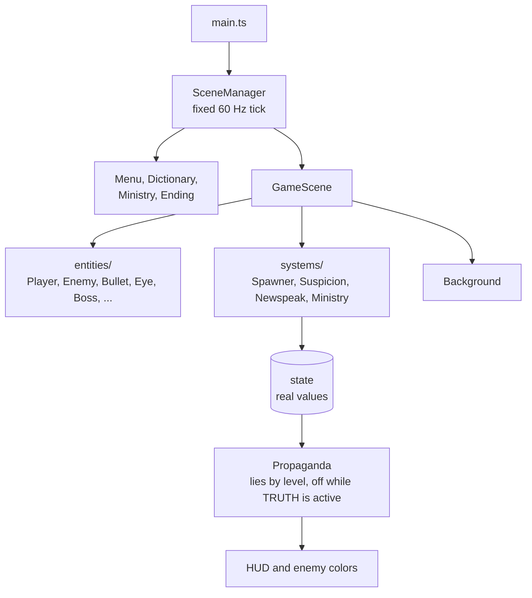
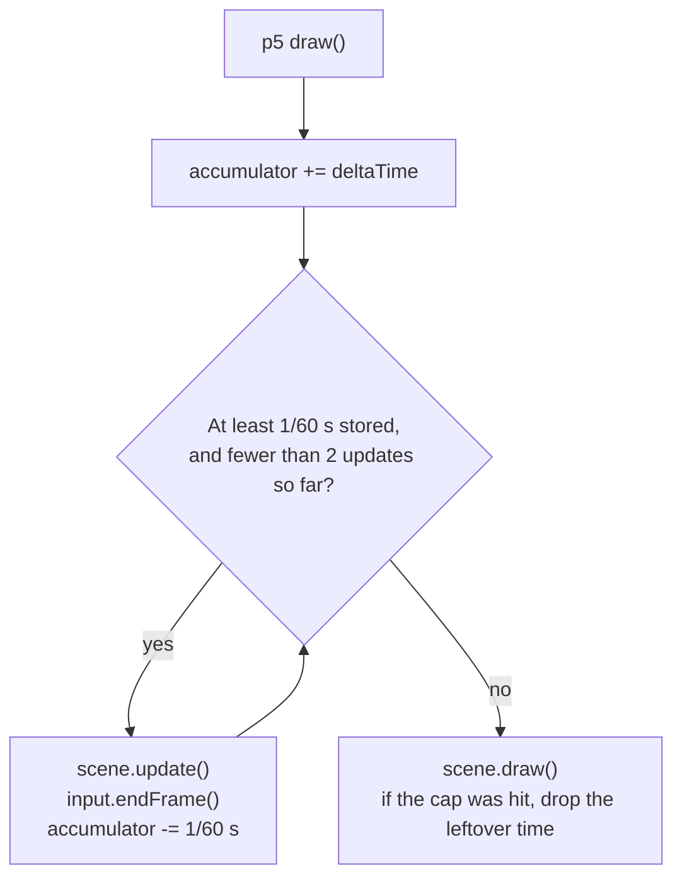
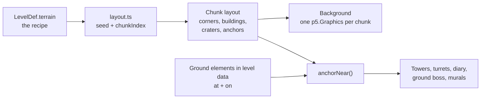
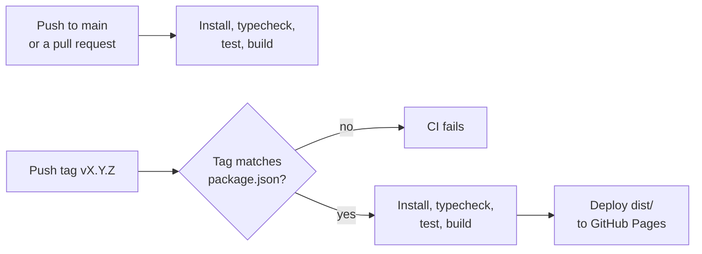

# Technical Reference

Stack, architecture, conventions, rendering, and tooling: how the code is built. How to run the project: [README](../README.md).

## Stack

| Tool | Version | Notes |
| ---- | ------- | ----- |
| TypeScript | 6.0.3 | `strict`; `vite/client` types come from `tsconfig.json` (no `vite-env.d.ts`). |
| Vite | 8.3.2 | `vanilla-ts`; serves `public/` at the site root. Builds with a relative base (`--base=./`), so the game runs under any path, such as GitHub Pages. |
| Vitest | 5.0.3 | Tests; uses Vite's resolution, so tests import modules as the game does. |
| p5.js | 2.3.4 | **Instance mode only** (`new p5(sketch)`). |
| pnpm | 12.3.4 | Pinned via `packageManager`. |
| Node.js | ≥ 22.12 | Required by Vite 8. |

Dependencies are pinned exactly (`pnpm-workspace.yaml`: `saveExact: true`; pnpm no longer reads it from `.npmrc`). No new runtime dependency without approval.

## Project structure

```
newspeak-1984/
├── index.html            # page shell: the #game frame between two decorative walls
├── package.json          # scripts, exact dependency versions, packageManager
├── pnpm-lock.yaml
├── tsconfig.json
├── pnpm-workspace.yaml   # pnpm settings (saveExact)
├── .githooks/            # commit-msg, pre-commit
├── .github/workflows/    # ci.yml: checks, and deploys tags to GitHub Pages
├── README.md             # project overview and how to run it
├── docs/                 # this documentation (start at docs/README.md)
├── public/
│   ├── favicon.png
│   └── assets/
│       ├── fonts/        # VT323, Courier Prime + OFL licenses
│       ├── illustrations/ # scene art
│       ├── sprites/      # gameplay sprites, landmarks, tilesets (+ .json), damage maps (.json), variants/
│       └── sounds/       # (empty)
└── src/
    ├── main.ts           # creates the p5 instance, delegates to SceneManager
    ├── style.css         # page styles: the telescreen wall, frame, and crisp canvas
    ├── config.ts         # every tunable number
    ├── state.ts          # global game state + resetLevelState()
    ├── types.ts          # shared types
    ├── i18n/             # en.ts, es.ts (all player-facing text), index.ts (detection, t())
    ├── core/             # Scene, SceneManager, Input, Collisions (theme-agnostic)
    ├── entities/         # Entity, Player, Bullet, Enemy, Explosion, Eye, Boss, Pickup
    ├── systems/          # Suspicion, Newspeak, Propaganda, Ministry, Spawner
    ├── levels/           # levels.ts (level data), layout.ts (city generator), Background
    ├── ui/               # HUD, Ticker, effects (scanlines, glitch, typewriter)
    └── scenes/           # Menu, Dictionary, Game, Ministry, Ending
```

## Code conventions

- **Language:** all code, comments, identifiers, file names, and commit messages are in English. Every player-facing string comes from `src/i18n/` (English and Spanish), never inline; `es.ts` is typed against `en.ts`, so edit both together.
- **Tests** sit next to the module they test (`Collisions.test.ts` beside `Collisions.ts`). Test pure logic (collisions, suspicion, the Ministry's corrections, `t()`, the city layout), not drawing.

## Architecture

- **`main.ts` is minimal:** `setup` and `draw` only create and call the `SceneManager`.
- **Scenes** implement `enter()`, `update()`, `draw()`, `exit()`. `SceneManager.change(next)` calls `exit()` then `enter()`.
- **Entities** extend `Entity` (`pos`, `vel`, `radius`, `alive`, `update()`, `draw(p)`).
- **The p5 instance is passed explicitly**, never stored globally.
- **`core/` is theme-agnostic:** scenes, input, circles; nothing about 1984.
- **The HUD never reads real state.** It asks `Propaganda` (`displayedLives()`, `displayedScore()`, `apparentColor()`, `isLying()`), a pass-through until the lies exist.
- **Levels are data, not code:** waves, eyes, turrets, pickups, diary location, boss, and the terrain recipe. The code turns the recipe into a city ([City layout](#city-layout)).
- **The scrolling background is drawn into `p5.Graphics`** (see [Background](#background)).



| Value | Lives in |
| ----- | -------- |
| Tunable numbers (speeds, rates, thresholds, colors, sizes, weights) | `config.ts` |
| Persistent state (lives, score, suspicion, words, stats, level) | `state.ts` |
| Shared types | `types.ts` |
| Level content (waves, eyes, pickups, diary, boss, terrain recipe), as plain data | `levels/levels.ts` |
| Per-frame entity lists | `GameScene` fields |

### Global state

The shape of `state` in `state.ts`. Step 1 creates the first block; each later step adds its fields:

```ts
{
  pilotId: number;            // random four digits, drawn once per run
  level: number;
  realLives: number;
  realScore: number;          // whole run; shown only in the rebel ending
  suspicion: number;          // 0–100; the Ministry rewrites it between levels
  alertLevel: 0 | 1 | 2 | 3;  // normal, alert, pursuit, Thought Police
  words: Set<Word>;           // available words: "FREE" | "ESCAPE" | "TRUTH" | "REMEMBER"
  stats: { kills: number; eyesDestroyed: number; framesSeen: number; diaries: number };  // this level

  // step 3
  bombs: number;
  wordLevels: Record<Word, number>;  // 1–3; kept when a word is removed
  restoredWord: Word | null;  // restored by a diary, for this level only
  runStats: { kills: number; officialKills: number; eyesDestroyed: number; framesSeen: number; diaries: number; pagesRead: number[] };

  // step 4
  levelStartScore: number;    // realScore when the level began
  officialScore: number;      // whole run; the only score the regime shows
  verdict: 0 | 1 | 2;         // the Ministry's verdict on the last level: hero, under review, suspect
}
```

## Runtime conventions

- **Time is in frames.** Game logic runs on a fixed 60 Hz tick and never reads `deltaTime`; `SceneManager` uses it only to count how many ticks to run per draw (at most 2), so the speed doesn't depend on the monitor's refresh rate. When the cap is hit, the leftover time is dropped, so a slow machine slows down instead of catching up in bursts later. Seconds are converted in `config.ts` (`0.5 s` → `30`). Slow machines slow the game down instead of skipping frames, like arcade hardware.
- **Canvas:** 480 × 640 logical pixels, centered, displayed at the largest integer scale that fits the window (CSS only; the game never sees the scale). `(0, 0)` is top-left; `y` grows downward.
- **Level coordinates** are scroll distance: something at `at: 1200` enters at the top edge once the background has scrolled 1200 px.
- **Vectors:** a plain `Vec = { x, y }` instead of `p5.Vector`, which keeps `core/` free of p5. Collisions compare squared distances: `dx*dx + dy*dy < (ra + rb)^2`.
- **Input:** keys by `KeyboardEvent.code` (layout-independent), with `preventDefault()` on game keys so arrows and Space don't scroll the page. Bindings: [gameplay.md › Controls](gameplay.md#controls), mirrored in `config.ts`.

The tick loop in `SceneManager.frame(ms)`:



## Rendering

### Loading

p5 2.x has no `preload()`. `await` every asset once in an async setup. Use relative paths (`assets/...`), never `/assets/...`, or they break under the Pages path:

```ts
p.setup = async () => {
  const player = await p.loadImage('assets/sprites/player.png');
  const machineFont = await p.loadFont('assets/fonts/VT323-Regular.ttf');
};
```

### Sprites

- `p.noSmooth()` once; draw at integer positions with `p.imageMode(p.CENTER)`. Never scale by a non-integer factor.
- **Never call `tint()` per frame:** the 2D renderer rebuilds a recolored image on every call. Use `sprites/variants/` ([assets.md › Variants](assets.md#variants-spritesvariants)).
- Transparency (camouflage, shadows): set `p.drawingContext.globalAlpha`, then restore it.
- Mirroring and 90° rotations are free canvas transforms. Other angles make pixel art jagged, so aircraft face straight up or down, and parts that must aim or spin (AA barrels, gyro rotor) are p5 lines ([assets.md › p5 additions](assets.md#assets-that-need-p5-additions)).

### Text

- All player-facing text comes from `src/i18n/` through `t(path, params)`; language detection runs once at startup. Files, placeholders, and the detection order: [text-and-language.md › Translation files](text-and-language.md#translation-files).
- Fonts, sizes, colors, strike-throughs, and the typewriter reveal: [text-and-language.md › Typography](text-and-language.md#typography).
- Canvas text is always antialiased, regardless of `noSmooth()`; that's fine at those sizes.
- Measure with `p.textWidth()` and wrap long paragraphs (briefings, corrections, diary pages); never assume English widths.

### City layout

`levels/layout.ts` turns a level's terrain recipe into a city. It is a pure function with no p5, so it can be tested. Terrain never collides with anything, so a generated map can't break the game: the generator only has to look believable and give ground elements sensible places to stand.

The recipe, `LevelDef.terrain`, describes intent, not tiles:

```ts
interface TerrainDef {
  seed: number;
  blocks: { plaza: number; rubble: number };   // share of city blocks; the rest stay open asphalt
  river?: { at: number; bridges: number };     // a band of water at this scroll distance
  railway?: { from: number; to: number };
  landmark?: { at: number };                   // the level's ministry
}
```

The level is cut into chunks of 480 × `CHUNK_HEIGHT` px (15 columns of 32 px cells). Each chunk is generated from `seed + chunkIndex` by a small seeded generator of its own (mulberry32, a few lines), separate from `p.random`, so gameplay randomness never changes the map and a level always looks the same. The rules, in order:

1. **Streets.** Vertical streets keep the same columns for the whole level (chosen once from `seed`), so they continue across chunks. Every chunk begins and ends on a horizontal street, so no block crosses a chunk edge. Blocks are at least `MIN_BLOCK_CELLS` on each side.
2. **Blocks.** Each block between streets becomes plaza, rubble, or open asphalt, by the recipe's shares. Most plazas get a procedural building, inset one cell; some buildings have a skylight or a Party banner.
3. **Craters** on random asphalt cells.
4. **River:** a band of water across the full width at `at`, with a street row on each side. `bridges` of the vertical streets continue over it on `bridge.png`.
5. **Railway:** one vertical street widens into a two-cell corridor from `from` to `to`, with `railway.png` tiled along it.
6. **Landmark:** a plaza block sized for the 128 px ministry, centered at `at`.

Streets keep asphalt between any two other terrains, which is what the Wang tilesets need: a cell can mix asphalt with only *one* of plaza, rubble, or water.

A chunk's layout holds the terrain on tile corners, the buildings (rect, skylight, banner), the craters, and the **anchors**: points where ground elements can stand, by kind (`street`, `plaza`, `rooftop`, `skylight`, `bridge`, `railway`, `landmark`), in level space (`y` is scroll distance).

**Ground placement.** Level data places ground elements by intent: `{ at, on: 'bridge' }` stands on the anchor of that kind nearest to `at`. `anchorNear(level, kind, at)` generates the chunk it needs if it doesn't exist yet, and caches it. Air elements (waves, drones, the blimp, air bosses) keep plain coordinates.



### Background

The background is prerendered into `p5.Graphics` **chunks**, one per layout chunk, 480 px wide and `CHUNK_HEIGHT` tall (taller than the canvas). A chunk is built when the scroll reaches it, and each frame draws only the current and next chunk: two `image()` calls, however much a chunk holds.

Layers per chunk, all read from its layout:

1. **Ground (Wang tiles).** For each 32×32 cell, find the tile whose `corners` match (`lower` = asphalt; `upper` = plaza, rubble, or water, each from its own tileset) and copy its rect.
2. **Decals and tracks:** craters, bridges, and the railway strip.
3. **Buildings:** procedural rooftops, with their skylights and banners.
4. **Landmarks and messages:** the level's ministry, rooftop murals, ground slogans.

**Text is not baked into chunks.** Draw changing slogans each frame at their scrolled position, or redraw only that region when the text flips. Towed banners move, so they are drawn every frame.

Keep the ground dark (`#1a1a1a` asphalt, `#3a3a3a` plazas and rubble) so moving sprites (`#7a7a7a`, `#e8e4d8`) always stand out.

### Progressive damage

Bosses show damage hole by hole, driven by code and two assets per boss: `boss-*-damaged.png` (fully wrecked) and `boss-*-damage.json`:

```json
{ "sprite": "boss-fortress.png", "damaged": "boss-fortress-damaged.png",
  "regions": [{ "x": 19, "y": 54, "w": 22, "h": 19 }, …] }
```

1. At load, copy the clean sprite into a `p5.Graphics` the size of the sprite. Draw the boss from it.
2. Each time hp changes, compute how many regions should show: `shown = min(n, ceil(n × (1 − hp / maxHp) / (1 − DAMAGE_END)))`, with `DAMAGE_END` ≈ 0.2 in `config.ts` (the hp fraction where the boss is fully wrecked).
3. For each newly shown region, replace that rect: `g.noStroke(); g.erase(); g.rect(x, y, w, h); g.noErase(); g.image(damaged, x, y, w, h, x, y, w, h)`. Without `noStroke()` the erase bleeds 1 px past the rect. Erasing first matters, because holes are transparent and drawing alone would not clear the clean pixels.

Regions are revealed in file order, and the last one leaves the graphics identical to the damaged sprite (verified for all five bosses). The work happens only when a region appears, never per frame. The hit flash and shadow use the clean `-flash` and `-shadow` variants; tiny mismatches at the holes don't show at ~3 frames.

### Performance budget

| Item | Rule |
| ---- | ---- |
| Background | 2 `image()` calls per frame. |
| Sprites | One `image()` each; all images total under 250 KB. |
| Bullets | `p.circle()`, the cheapest primitive. |
| Glitch | `p.copy()` on a few horizontal slices; none at suspicion 0. The most expensive effect: cap the slice count in `config.ts`. |
| Scanlines | One prerendered `p5.Graphics` overlay. |
| Red vignette | One prerendered `p5.Graphics` (red edges, transparent center), drawn with an alpha driven by suspicion. Never rebuilt per frame. |
| Never per frame | `tint()`, `loadPixels()`/`get()` on images, creating `p5.Graphics`. (Boss damage graphics are created once, at load.) |

## Tooling

| Command | Does |
| ------- | ---- |
| `pnpm dev` | Dev server with hot reload. |
| `pnpm typecheck` | `tsc --noEmit`; run after every change. |
| `pnpm test` | Run the tests once (`vitest run`); `pnpm vitest` watches. |
| `pnpm build` | Typecheck and build to `dist/`. |
| `pnpm preview` | Serve the build. |

### Git

- **[Conventional Commits](https://www.conventionalcommits.org/):** `<type>(<scope>): <summary>`, imperative, lowercase, no trailing period.
  - Types: `feat fix refactor perf style docs test build chore`.
  - Scope is optional: the `src/` folders (`core`, `entities`, `systems`, `levels`, `ui`, `scenes`) plus `config`, `state`, `deps`, `release`.
  - Header of 72 characters or fewer, and a blank line before the body.
  - Breaking changes: `!` after the type/scope and a `BREAKING CHANGE:` footer.
- **One logical change per commit;** the game must typecheck and run at every commit.
- **Hooks** (`.githooks/`, activated by `pnpm install` through the `prepare` script, which sets `core.hooksPath`): `commit-msg` validates the message, `pre-commit` runs `pnpm typecheck`. Never bypass them with `--no-verify`.
- **Versioning:** [SemVer](https://semver.org/) in `package.json`. While in `0.x`, each completed implementation step bumps the minor version (`0.1.0` → `0.2.0`) and fixes bump the patch. Releases get their own commit (`chore(release): vX.Y.Z`) and an annotated tag `vX.Y.Z`. `1.0.0` = the full game playable through both endings.
- Only the project owner pushes.

### CI and deploy

`.github/workflows/ci.yml` runs on every push to `main` and every pull request: install with the frozen lockfile, typecheck, test, build. Pushing a `vX.Y.Z` tag runs the same checks, fails if the tag doesn't match the `package.json` version, and deploys `dist/` to GitHub Pages, so the published game is always a release.



One-time setup on GitHub:
- **Settings › Pages › Source:** GitHub Actions.
- **Settings › Environments › github-pages › Deployment branches and tags:** add a tag rule `v*` (by default only the default branch may deploy).
